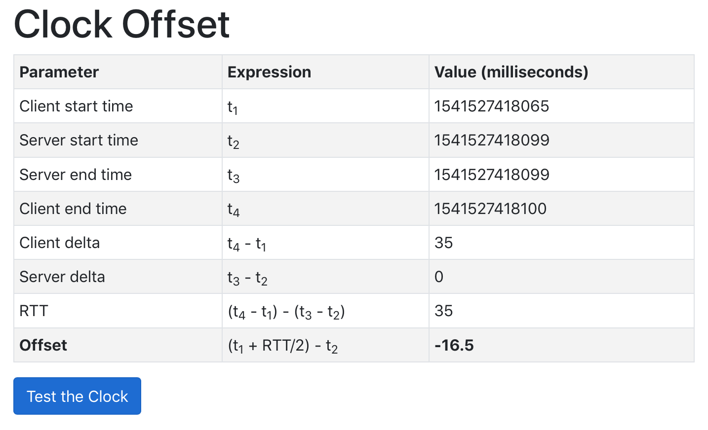

# Assignment 4 #

### Program description ###

A simple web-based program that allows to measure the offset between the clock on the system that runs a browser and a web server.

- **Platform** macOS/Linux
- **Library** Python Flask

#### Preparation

This program requires Python Flask

- create a virtual environment called project_venv `python3 -m venv project_venv`
- activate virtual environment `source project_venv/bin/activate`
- install Flask `pip install flask`

#### Usage

- on server side
  - run `FLASK_APP=server.py flask run --host=0.0.0.0 [-p port_number]`

- on client side
  - access `server:port_number/time.html`
  - click on "Test the Clock" button, the table should display clock offset value

##### Example Output

- server side

```
$ FLASK_APP=server.py flask run --host=0.0.0.0 -p 25002
 * Serving Flask app "server.py"
 * Environment: production
   WARNING: Do not use the development server in a production environment.
   Use a production WSGI server instead.
 * Debug mode: off
 * Running on http://0.0.0.0:25002/ (Press CTRL+C to quit)
73.61.104.123 - - [07/Nov/2018 22:29:47] "GET / HTTP/1.1" 404 -
73.61.104.123 - - [07/Nov/2018 22:29:47] "GET /favicon.ico HTTP/1.1" 404 -
73.61.104.123 - - [07/Nov/2018 22:29:53] "GET /time.html HTTP/1.1" 200 -
73.61.104.123 - - [07/Nov/2018 22:29:53] "GET /favicon.ico HTTP/1.1" 404 -
73.61.104.123 - - [07/Nov/2018 22:29:55] "GET /servertime HTTP/1.1" 200 -
```

- client side


